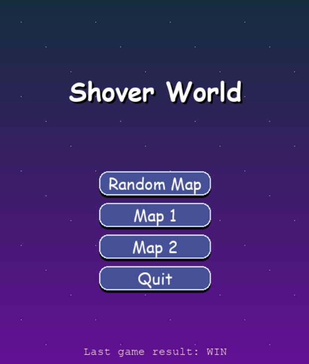
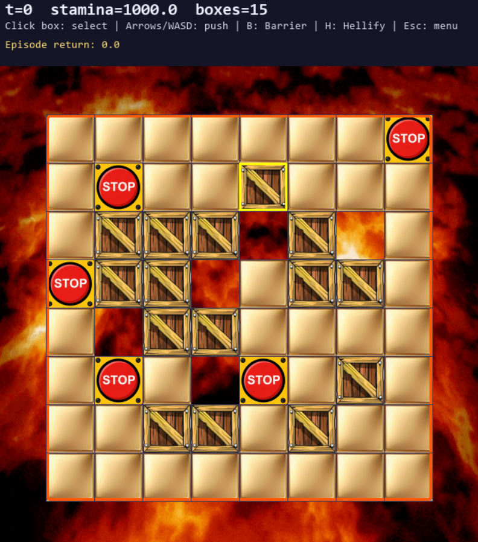

# 📦 Shover-World

### *Strategic Box-Pushing with Physics & Stamina Management*

  
**Shover-World** is not just a puzzle game—it's a grid-based simulation where every move costs energy. Manage your stamina, utilize momentum physics to push chains of heavy boxes, and master special abilities by identifying geometric patterns in the environment.


<p align="center">
  
</p>


-----

## 🧠 Architecture: Brains & Beauty

The project is divided into two distinct modules:

  * **`environment.py` (The Brain):** Handles the rigorous logic, state management, physics calculations, and collision detection.
  * **`gui.py` (The Face):** A responsive interface built with **Pygame** that renders the grid, handles user input, and provides visual feedback.

-----

## 🎮 Game Mechanics

### 1\. The Grid World 🗺️

The map is a matrix of possibilities. Here is what the values represent:

| Object | Description |
| :--- | :--- |
| **Empty Space (0)** | Safe ground to move. |
| **Box (1 - 10)** | Pushable objects. Heavy\! |
| **Wall (1, 100)** | Immovable barriers. |
| **Lava (-100)** | 🌋 Danger zone\! Pushing boxes here destroys them but refunds Stamina. |

<p align="center">
  
</p>

### 2\. Physics & Movement 🏗️

  * **Chain Reaction:** You aren't just pushing one box. If boxes are lined up, you push the *entire chain*.
  * **Collision:** If the chain hits a wall or the map edge, movement is blocked.
  * **Momentum:** The game tracks physics. Starting a stopped box takes more effort than keeping a moving box in motion\!

### 3\. The Stamina System 🔋

Your energy is finite ($S_0 = 1000.0$). If it hits 0, it's **Game Over**.

> **The Physics Formula:**
> `ΔS_push = F_initial * I_stationary + F_unit * k`
>
>   * **Walking:** Low cost.
>   * **Pushing:** Costs more based on how many boxes ($k$) are in the chain.
>   * **Friction:** Overcoming static friction ($F_{initial}$) is expensive. Don't stop moving\!

-----

## ✨ Special Abilities: "Perfect Squares"

The environment scans for isolated **$2\times2$** or **$3\times3$** blocks of boxes (Perfect Squares). Act fast\! These squares have an "age" and will disappear if ignored.

### 🧱 Barrier Maker (`B` Key)

Transforms a block of boxes into solid walls.

  * **Benefit:** Grants a massive **Stamina Boost**.

### 😈 Hellify (`H` Key)

Turns the center of a $3\times3$ square into **Lava** and removes the borders.

  * **Benefit:** Creates a hazard zone to destroy boxes (and get stamina refunds).

-----

## 🖥️ Interface & Controls

The game features a **Main Menu** to select between Random Maps or preset Levels.

### ⌨️ Keyboard Controls

| Key | Action |
| :---: | :--- |
| **WASD / Arrows** | Move Agent / Push Boxes |
| **B** | Trigger **Barrier Maker** |
| **H** | Trigger **Hellify** |
| **R** | Reset Game |
| **Q / ESC** | Quit Game |
| **Mouse** | Select Target Box |

-----

## ✅ Reliability & Testing

We take code quality seriously. A comprehensive `pytest` suite ensures the physics engine is bug-free.

  * **Map Loading:** Handles integers/symbols and catches errors.
  * **Physics:** Verifies chain pushing and wall collisions.
  * **Pattern Detection:** Accurately finds Perfect Squares.
  * **Economy:** Verifies Stamina costs and refunds.

🏆 **Result:** 15/15 Tests Passed.

-----

## 🚀 Getting Started

1.  **Install Dependencies:**
    ```bash
    pip install pygame numpy pytest
    ```
2.  **Run the Game:**
    ```bash
    python gui.py
    ```
